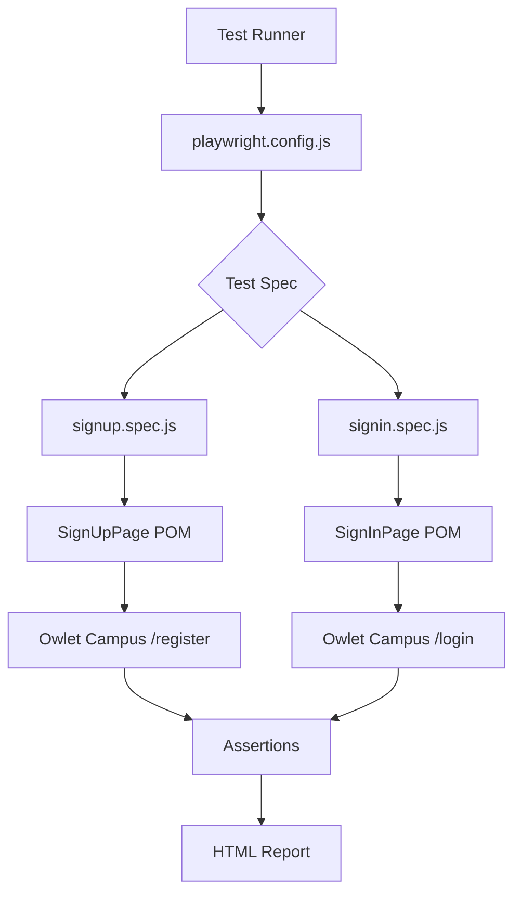

# Design Document: Playwright Auth Automation

## Overview

This design covers a Playwright + JavaScript test suite for the Sign-Up and Sign-In modules of the Owlet Campus web application (`https://owlet-campus.com/`). The suite follows the Page Object Model (POM) pattern to keep selectors and interactions encapsulated, separate from test logic.

The primary goals are:
- Convert manual test cases into automated, repeatable scripts
- Cover both positive and negative scenarios for registration and login
- Produce clear failure messages and an HTML report for CI consumption

## Architecture

The project is a standalone Node.js package. Playwright is the only runtime dependency. Tests run against the live application (no mocking of the server).

```
playwright-auth-automation/
├── playwright.config.js        # Base URL, reporter, browser config
├── package.json
├── pages/
│   ├── SignUpPage.js           # Page Object for registration
│   └── SignInPage.js           # Page Object for login
└── tests/
    ├── signup.spec.js          # Sign-Up test scenarios
    └── signin.spec.js          # Sign-In test scenarios
```

### Flow Diagram



## Components and Interfaces

### `playwright.config.js`

Configures the test runner globally.

| Setting | Value |
|---|---|
| `baseURL` | `https://owlet-campus.com/` |
| `reporter` | `[['html', { open: 'never' }]]` |
| `use.headless` | `true` |
| `testDir` | `./tests` |

### `SignUpPage` (pages/SignUpPage.js)

Encapsulates all interactions with the registration page.

```
class SignUpPage
  constructor(page)
  navigate()                                          → Promise<void>
  fillForm(name, email, password, confirmPassword)    → Promise<void>
  submit()                                            → Promise<void>
  register(name, email, password, confirmPassword)    → Promise<void>
  // Locator accessors (getters)
  get nameInput()         → Locator
  get emailInput()        → Locator
  get passwordInput()     → Locator
  get confirmInput()      → Locator
  get registerButton()    → Locator
```

### `SignInPage` (pages/SignInPage.js)

Encapsulates all interactions with the login page.

```
class SignInPage
  constructor(page)
  navigate()                          → Promise<void>
  fillForm(email, password)           → Promise<void>
  submit()                            → Promise<void>
  login(email, password)              → Promise<void>
  // Locator accessors (getters)
  get emailInput()    → Locator
  get passwordInput() → Locator
  get loginButton()   → Locator
```

### Test Specs

Both specs follow the same structure:

1. Import the relevant Page Object
2. Declare a `test.beforeEach` that instantiates the POM and calls `navigate()`
3. Individual `test()` blocks exercise one scenario each, using `expect()` for assertions

## Data Models

There are no persistent data models — the suite operates against the live application. Test data is defined as inline constants or fixtures within each spec file.

### Test Data Shape

```js
// Positive case
const validUser = {
  name: 'Test User',
  email: 'testuser@example.com',
  password: 'SecurePass123!',
  confirmPassword: 'SecurePass123!'
}

// Negative cases
const duplicateEmail = 'existing@owlet-campus.com'
const invalidEmail   = 'not-an-email'
const mismatchPass   = { password: 'Pass123!', confirm: 'Different456!' }
```

Credentials for the Sign-In positive test (valid registered account) are stored as constants at the top of `signin.spec.js` and should be replaced with environment variables (`process.env.TEST_EMAIL`, `process.env.TEST_PASSWORD`) before running in CI.


## Correctness Properties

*A property is a characteristic or behavior that should hold true across all valid executions of a system — essentially, a formal statement about what the system should do. Properties serve as the bridge between human-readable specifications and machine-verifiable correctness guarantees.*

The following properties were derived from the acceptance criteria. Properties are tested using a property-based testing library (fast-check for JavaScript). Each property runs a minimum of 100 iterations.

**Property Reflection:** After prework analysis, the following criteria yield testable properties:
- 2.2 and 3.2 are structurally identical (fillForm round-trip) — kept as one property per page object since they test different classes.
- 2.4 and 3.4 (convenience method equivalence) are subsumed by 2.2/3.2 + the submit behavior; they can be combined into the fillForm round-trip properties since the observable state after register()/login() is the same as fillForm()+submit().
- 4.3 (invalid email format) and 5.2 (invalid credentials) are distinct properties covering different validation layers.
- 4.4 (password mismatch) and 4.5 (empty fields) are distinct properties.
- 5.2 and 5.4 both test "wrong credentials produce an error" — 5.2 is the general property that subsumes 5.4 (known email + wrong password is just one instance of invalid credentials). Consolidated into one property.

### Property 1: SignUpPage fillForm round-trip

*For any* combination of name, email, password, and confirmPassword strings, after calling `fillForm(name, email, password, confirmPassword)` on a navigated SignUpPage, each corresponding input field's value should equal the string that was passed in.

**Validates: Requirements 2.2**

### Property 2: SignInPage fillForm round-trip

*For any* email and password string, after calling `fillForm(email, password)` on a navigated SignInPage, the email field value should equal the email argument and the password field value should equal the password argument.

**Validates: Requirements 3.2**

### Property 3: Invalid email format always triggers validation error

*For any* string that does not conform to a standard email address format (i.e., lacks an `@` with a domain), submitting it in the Sign-Up email field should result in a visible validation error message before or after form submission.

**Validates: Requirements 4.3**

### Property 4: Mismatched passwords always trigger a mismatch error

*For any* two strings where `password !== confirmPassword`, submitting the Sign-Up form with those values should result in a visible password-mismatch error message.

**Validates: Requirements 4.4**

### Property 5: Empty required fields always trigger validation messages

*For any* non-empty subset of the required Sign-Up fields (name, email, password, confirmPassword) that is left blank while the others are filled, submitting the form should result in a visible required-field validation message for each empty field.

**Validates: Requirements 4.5**

### Property 6: Invalid credentials always produce an authentication error

*For any* email/password pair that is not a registered account in the system, submitting the Sign-In form should result in a visible error message indicating invalid or unrecognised credentials.

**Validates: Requirements 5.2, 5.4**

## Error Handling

| Scenario | Handling |
|---|---|
| Playwright locator not found | Playwright throws `TimeoutError` by default; page objects do not catch or suppress it (Requirements 2.6, 3.6) |
| Network / navigation timeout | Playwright's default timeout applies; tests fail with a descriptive timeout message |
| Test data collision (duplicate email) | Negative test explicitly uses a known-duplicate email; positive test should use a unique email per run (timestamp suffix or env var) |
| Missing env vars for CI credentials | Tests read `process.env.TEST_EMAIL` / `process.env.TEST_PASSWORD`; if undefined, the test is skipped with `test.skip()` |

## Testing Strategy

### Dual Approach

The suite uses two complementary layers:

1. **Example-based tests** (Playwright `test()` blocks) — cover specific, deterministic scenarios: successful registration, successful login, known duplicate email, empty form submission.
2. **Property-based tests** (fast-check + Playwright) — cover universal properties across generated inputs: fillForm round-trips, invalid email formats, mismatched passwords, empty field combinations, invalid credential pairs.

### Property-Based Testing Setup

- Library: **fast-check** (`npm install --save-dev fast-check`)
- Minimum iterations per property: **100** (`{ numRuns: 100 }`)
- Each property test is tagged with a comment referencing the design property:
  ```js
  // Feature: playwright-auth-automation, Property 1: SignUpPage fillForm round-trip
  ```

### Test File Breakdown

**`tests/signup.spec.js`**
| Test | Type | Requirement |
|---|---|---|
| `should register successfully with valid data` | Example | 4.1 |
| `should show error for duplicate email` | Example | 4.2 |
| `should show error for invalid email format (property)` | Property | 4.3 |
| `should show mismatch error for different passwords (property)` | Property | 4.4 |
| `should show required-field errors for empty fields (property)` | Property | 4.5 |
| `fillForm should populate all fields (property)` | Property | 2.2 |

**`tests/signin.spec.js`**
| Test | Type | Requirement |
|---|---|---|
| `should login successfully with valid credentials` | Example | 5.1 |
| `should show error for invalid credentials (property)` | Property | 5.2, 5.4 |
| `should show validation message for empty form` | Edge case | 5.3 |
| `fillForm should populate email and password fields (property)` | Property | 3.2 |

### Reporting

- HTML reporter configured in `playwright.config.js` (`open: 'never'` for CI compatibility)
- Report output directory: `playwright-report/`
- Run command: `npx playwright test`
- Single-run (no watch): `npx playwright test --reporter=html`
