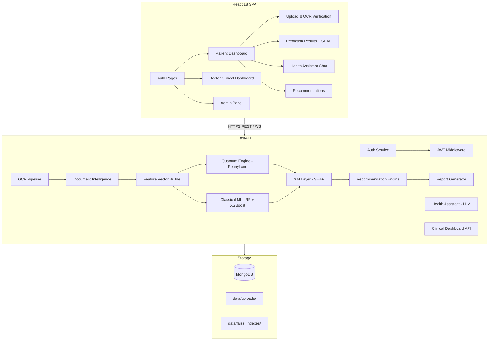

# Design Document: QuantumHealthAI

## Overview

QuantumHealthAI is a full-stack health intelligence platform that combines OCR-based medical report extraction, quantum and classical ML disease risk prediction, SHAP explainability, an AI health assistant, and a clinical dashboard. The existing codebase (`app.py`) is a Flask-based RAG prototype; this design describes a complete rebuild using FastAPI + React 18, retaining the `data/` directory structure for uploads and indexes.

The platform targets three diseases — Diabetes, Cardiovascular Disease (CVD), and Chronic Kidney Disease (CKD) — and serves three roles: Patient, Doctor, and Admin.

---

## Architecture

The system follows a layered, service-oriented architecture with a React SPA frontend communicating with a FastAPI backend over a REST + WebSocket API. All health data is stored in MongoDB via Motor (async driver). File storage uses the existing `data/uploads/` directory with AES-256 encryption at rest.



### Key Architectural Decisions

- **FastAPI over Flask**: Async support for concurrent OCR + ML workloads; native OpenAPI docs; dependency injection for auth middleware.
- **MongoDB over SQLite**: Document-oriented storage fits variable lab parameter schemas; Motor provides non-blocking I/O.
- **Dual prediction pipeline**: Quantum (PennyLane VQC) runs first; Classical (RF + XGBoost) runs in parallel as fallback and comparison.
- **Background tasks**: OCR processing and PDF generation run as FastAPI `BackgroundTasks` to avoid blocking the request cycle.
- **Existing data directory**: `data/uploads/`, `data/faiss_indexes/`, and `data/db/` are preserved; MongoDB replaces SQLite for application data.

---

## Components and Interfaces

### Auth Service

Handles registration, login, JWT issuance, and RBAC enforcement.

```
POST /api/auth/register   → RegisterRequest → AuthResponse
POST /api/auth/login      → LoginRequest    → TokenPair
POST /api/auth/refresh    → RefreshRequest  → TokenPair
GET  /api/auth/me         → (JWT)           → UserProfile
```

JWT middleware is a FastAPI dependency injected into all protected routes. Role enforcement uses a `require_role(roles: list[Role])` dependency.

### OCR Pipeline

Accepts file uploads, runs Tesseract + PaddleOCR in a background task, returns a job ID for polling.

```
POST /api/ocr/upload          → UploadRequest  → JobStatus
GET  /api/ocr/status/{job_id} → JobStatus
GET  /api/ocr/result/{job_id} → OCRResult
```

Processing strategy: PaddleOCR runs first (better table detection); Tesseract is used as fallback or for plain-text regions. Results are merged and deduplicated.

### Document Intelligence

Parses OCR output into structured `LabParameter` objects, normalizes units, flags abnormal values, and exposes a verification endpoint.

```
POST /api/documents/verify    → VerifyRequest  → VerifiedLabValues
GET  /api/documents/{doc_id}  → DocumentDetail
```

Unit normalization uses a lookup table mapping common unit variants (e.g., `mg/dL`, `mmol/L`) to SI base units with conversion factors.

### Quantum Engine

Builds the Feature Vector and runs the VQC circuit via PennyLane.

```
POST /api/predict/quantum  → FeatureVector → PredictionResult
```

Circuit design: 14-qubit register, `AngleEmbedding` for feature encoding, 3 layers of `StronglyEntanglingLayers`, measurement of expectation values mapped to [0, 100] risk scores.

### Classical ML

Runs RF + XGBoost ensemble prediction.

```
POST /api/predict/classical  → FeatureVector → PredictionResult
```

Models are pre-trained and loaded at startup from `data/models/`. Prediction is synchronous and returns within 2 seconds.

### XAI Layer

Computes SHAP values using `shap.TreeExplainer` for classical models and a kernel-based approximation for quantum outputs.

```
POST /api/explain/{prediction_id}  → ExplanationResult
```

Returns SHAP values per feature, waterfall chart data (JSON for Chart.js rendering), and an LLM-generated natural language summary.

### Health Assistant

Context-aware chatbot backed by an LLM (Gemini or OpenAI), with patient lab values and risk scores injected into the system prompt.

```
WS  /api/assistant/ws/{session_id}   → streaming chat
POST /api/assistant/message          → ChatMessage → ChatResponse
```

Session context is stored in MongoDB and retrieved per session ID. The system prompt includes a disclaimer for medical diagnosis requests.

### Recommendation Engine

Generates personalized recommendations post-prediction.

```
GET /api/recommendations/{prediction_id}  → RecommendationList
```

Two-stage: rule-based engine applies clinical thresholds first, then an LLM enriches recommendations with lifestyle context.

### Clinical Dashboard API

Doctor-facing endpoints for patient management.

```
GET  /api/clinical/high-risk          → PatientList (Risk > 75)
GET  /api/clinical/patient/{id}       → PatientDetail
POST /api/clinical/export/bulk        → BulkExportRequest → ExportJob
PUT  /api/clinical/patient/{id}/status → StatusUpdate
```

### Report Generator

Produces PDF reports using ReportLab for layout and WeasyPrint for HTML-to-PDF rendering of SHAP charts.

```
POST /api/reports/generate/{patient_id}  → ReportJob
GET  /api/reports/{report_id}/download   → PDF stream
POST /api/reports/{report_id}/share      → ShareableLink (72h TTL)
GET  /api/reports/shared/{token}         → PDF stream or 410
```

---

## Data Models

### User

```python
class User(BaseModel):
    id: PyObjectId
    email: EmailStr
    password_hash: str          # bcrypt
    role: Literal["patient", "doctor", "admin"]
    created_at: datetime
    is_active: bool = True
```

### LifestyleProfile

```python
class LifestyleProfile(BaseModel):
    user_id: PyObjectId
    bmi: float
    family_history: dict[str, bool]   # {"diabetes": True, "cvd": False, "ckd": False}
    smoking_status: Literal["never", "former", "current"]
    alcohol_frequency: Literal["never", "occasional", "regular"]
    exercise_frequency: int            # days/week 0-7
    diet_type: str
    sleep_hours: float                 # hours/night
    stress_level: int                  # 1-10
    medications: list[str]
    updated_at: datetime
```

### LabParameter

```python
class LabParameter(BaseModel):
    name: str                          # e.g. "glucose"
    value: float
    unit: str                          # normalized SI unit
    reference_range: tuple[float, float]
    is_abnormal: bool
    raw_text: str                      # original OCR text
```

### Document

```python
class Document(BaseModel):
    id: PyObjectId
    user_id: PyObjectId
    filename: str
    file_hash: str
    file_size_bytes: int
    upload_time: datetime
    ocr_status: Literal["pending", "processing", "complete", "failed"]
    lab_parameters: list[LabParameter]
    verified: bool = False
    verified_at: datetime | None
```

### FeatureVector

```python
class FeatureVector(BaseModel):
    user_id: PyObjectId
    document_id: PyObjectId
    features: list[float]              # exactly 14 dimensions
    feature_names: list[str]           # length 14
    constructed_at: datetime
```

The 14 features are: glucose, HbA1c, creatinine, cholesterol, triglycerides, hemoglobin, BMI, age, systolic_bp, diastolic_bp, smoking_encoded, exercise_frequency, sleep_hours, stress_level.

### PredictionResult

```python
class PredictionResult(BaseModel):
    id: PyObjectId
    user_id: PyObjectId
    feature_vector_id: PyObjectId
    model_used: Literal["quantum", "classical"]
    risk_scores: dict[str, float]      # {"diabetes": 42.3, "cvd": 67.1, "ckd": 18.9}
    quantum_scores: dict[str, float] | None
    classical_scores: dict[str, float] | None
    shap_values: dict[str, list[float]] | None
    timestamp: datetime
```

### Recommendation

```python
class Recommendation(BaseModel):
    disease: str
    text: str
    priority: int                      # derived from SHAP magnitude
    source: Literal["rule", "llm"]
    requires_physician: bool
```

### Report

```python
class Report(BaseModel):
    id: PyObjectId
    patient_id: PyObjectId
    generated_by: PyObjectId           # user who requested
    prediction_id: PyObjectId
    file_path: str
    share_token: str | None
    share_expires_at: datetime | None
    created_at: datetime
```

### MongoDB Collections

| Collection | Description |
|---|---|
| `users` | User accounts |
| `lifestyle_profiles` | Patient lifestyle data |
| `documents` | Uploaded medical reports + lab parameters |
| `feature_vectors` | Constructed 14-dim vectors |
| `predictions` | Prediction results (quantum + classical) |
| `recommendations` | Generated recommendations per prediction |
| `reports` | Generated PDF metadata + share tokens |
| `chat_sessions` | Health assistant sessions |
| `chat_messages` | Per-session message history |
| `audit_log` | Doctor access events (Req 13.5) |

---

## Correctness Properties

*A property is a characteristic or behavior that should hold true across all valid executions of a system — essentially, a formal statement about what the system should do. Properties serve as the bridge between human-readable specifications and machine-verifiable correctness guarantees.*

### Property 1: Lab Parameter Serialization Round-Trip

*For any* valid `LabParameter` object, serializing it to JSON and then deserializing it SHALL produce an object equal to the original.

**Validates: Requirements 4.7, 4.8**

---

### Property 2: Feature Vector Dimensionality Invariant

*For any* valid combination of lab values and lifestyle profile, the constructed `FeatureVector` SHALL always contain exactly 14 elements.

**Validates: Requirements 5.1, 6.3**

---

### Property 3: Risk Score Range Invariant

*For any* valid `FeatureVector`, the `Risk_Score` produced by both the Quantum Engine and the Classical ML component SHALL be a value in the closed interval [0, 100] for each target disease.

**Validates: Requirements 5.3, 6.1**

---

### Property 4: Quantum-Classical Score Agreement on Boundary

*For any* `FeatureVector` where all features are at their population mean, both the quantum and classical models SHALL produce a `Risk_Score` within 30 points of each other (models are trained on the same data distribution).

**Validates: Requirements 5.3, 6.1, 6.5**

---

### Property 5: Fallback Activation on Quantum Failure

*For any* prediction request where the Quantum Engine raises an exception or times out, the system SHALL return a valid `PredictionResult` using the Classical ML model with `model_used = "classical"`.

**Validates: Requirements 5.5, 14.2**

---

### Property 6: SHAP Values Sum to Prediction

*For any* `PredictionResult`, the sum of all SHAP values for a given disease SHALL approximately equal the difference between the model's predicted risk score and the base (expected) risk score (within floating-point tolerance of 0.01).

**Validates: Requirements 7.1**

---

### Property 7: Recommendation Count for High-Risk Predictions

*For any* `PredictionResult` where a disease's `Risk_Score` exceeds 30, the `Recommendation_Engine` SHALL generate at least 3 recommendations for that disease.

**Validates: Requirements 9.1**

---

### Property 8: Physician Referral for Critical Risk

*For any* `PredictionResult` where any disease's `Risk_Score` exceeds 75, the generated recommendations SHALL include at least one recommendation with `requires_physician = True`.

**Validates: Requirements 9.5**

---

### Property 9: Shareable Link Expiry Enforcement

*For any* shareable report link, accessing it after its `share_expires_at` timestamp SHALL return HTTP 410, and accessing it before that timestamp SHALL return HTTP 200 with the PDF content.

**Validates: Requirements 11.3, 11.5**

---

### Property 10: JWT Expiry Enforcement

*For any* JWT issued by the Auth Service, a request made after the token's expiry time SHALL be rejected with HTTP 401, and a request made before expiry with a valid signature SHALL be accepted.

**Validates: Requirements 1.2, 1.3**

---

### Property 11: RBAC Patient Data Isolation

*For any* two distinct Patient users A and B, a request authenticated as Patient A to retrieve Patient B's documents, predictions, or recommendations SHALL be rejected with HTTP 403.

**Validates: Requirements 1.5, 13.4**

---

### Property 12: Doctor Access Audit Log

*For any* Doctor accessing a Patient's record, the system SHALL create an audit log entry containing the Doctor's user ID, the Patient's user ID, and the access timestamp — and that entry SHALL be retrievable from the audit log.

**Validates: Requirements 13.5**

---

## Error Handling

| Scenario | Component | Response |
|---|---|---|
| Expired/invalid JWT | Auth middleware | HTTP 401 |
| Insufficient role | RBAC dependency | HTTP 403 |
| File > 20 MB | Upload endpoint | HTTP 413 with message |
| Unsupported file type | Upload endpoint | HTTP 415 with message |
| OCR extracts no text | OCR Pipeline | Notify patient, prompt manual entry |
| Quantum Engine timeout (>15s) | Prediction router | Fall back to Classical ML, set `model_used="classical"` |
| Quantum Engine exception | Prediction router | Same fallback as timeout |
| Expired share link | Report endpoint | HTTP 410 |
| Duplicate email on register | Auth Service | HTTP 409 with descriptive message |
| Missing required onboarding field | Onboarding endpoint | HTTP 422 with field-level errors (FastAPI default) |
| MongoDB connection failure | Startup event | Log + return HTTP 503 on all data endpoints |
| PDF generation failure | Report Generator | HTTP 500 with retry suggestion |

All error responses follow a consistent envelope:

```json
{
  "error": "short_code",
  "message": "Human-readable description",
  "details": {}
}
```

---

## Testing Strategy

### Unit Tests (pytest)

Focus on pure functions and business logic:

- Auth: password hashing, JWT encode/decode, role enforcement logic
- Document Intelligence: unit normalization functions, abnormal flag logic, table parser
- Feature Vector Builder: dimension validation, missing value imputation
- Recommendation Engine: rule-based threshold logic
- Report Generator: share token generation and expiry calculation

### Property-Based Tests (Hypothesis)

Using `hypothesis` library with minimum 100 iterations per property. Each test is tagged with its design property.

```python
# Feature: quantum-health-ai, Property 1: Lab Parameter Serialization Round-Trip
@given(lab_parameter_strategy())
@settings(max_examples=100)
def test_lab_parameter_round_trip(param: LabParameter):
    assert LabParameter.model_validate_json(param.model_dump_json()) == param
```

Properties to implement as Hypothesis tests:
- Property 1: Lab parameter JSON round-trip
- Property 2: Feature vector always 14-dimensional
- Property 3: Risk scores always in [0, 100]
- Property 5: Fallback activates on quantum failure (mock quantum device)
- Property 6: SHAP values sum to prediction delta
- Property 7: Recommendation count ≥ 3 for risk > 30
- Property 8: Physician referral present when risk > 75
- Property 9: Share link expiry returns correct HTTP status
- Property 10: JWT expiry enforcement
- Property 11: RBAC patient data isolation
- Property 12: Doctor access audit log entry created

Properties 4 (quantum-classical agreement) is validated as an integration test with pre-trained model fixtures rather than a property test, since it depends on trained model weights.

### Integration Tests

- Full OCR pipeline: upload PDF → extract → verify → predict
- Quantum fallback: mock PennyLane device to raise exception, assert classical result returned
- Doctor access audit log: verify log entry created on patient record access
- High-risk alert: insert prediction with risk > 75, assert alert visible in clinical dashboard API

### Frontend Tests (Vitest + React Testing Library)

- Auth forms: validation, error display
- OCR verification interface: value editing, confirmation
- SHAP waterfall chart: renders with correct feature labels
- Health assistant: message send/receive, disclaimer on diagnosis request

### Performance Validation

- Load test with k6: 100 concurrent users, assert p95 page load < 3s
- OCR benchmark: 20 MB PDF processed within 30s
- Quantum prediction: assert response within 15s on `default.qubit` simulator
